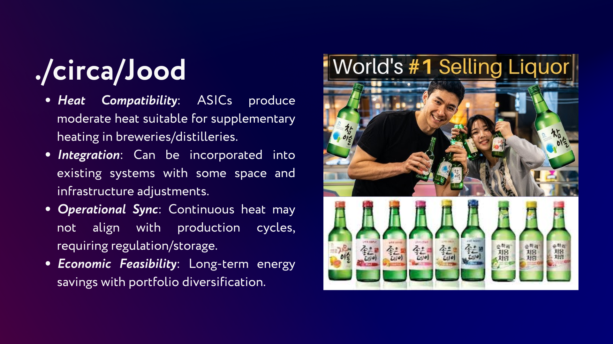

## 1. **ONE-SENTENCE IDEA:**
```
Circa transforms waste heat from decentralized computing infrastructure into valuable resources for agriculture, brewing/distilling, and heating, creating a sustainable circular economy.
```

## 2. **DETAILED DESCRIPTION:**
    Circa is an innovative Web3 ecosystem that addresses the significant energy inefficiencies in decentralized physical infrastructure networks (DePINs) by repurposing waste heat into productive applications. The project leverages high-performance computing hardware like ASICs, GPUs, and enterprise-grade SSDs, which generate substantial thermal energy during operations, and redirects this heat into sustainable and economically valuable processes.
    The core innovation lies in its multi-pronged approach: computational nodes generate both digital services and thermal energy, which is then strategically channeled into diverse applications. For example, the heat from mining operations can create ideal temperature conditions for mushroom cultivation, maintaining precise growing environments while reducing traditional energy consumption. In breweries and distilleries, the moderate heat from computing devices can supplement heating requirements, offering long-term energy savings and operational efficiency.
    Circa's ecosystem is designed to be inclusive and circular, partnering with hosting companies, power providers, miners, and real estate operators to create a networked solution. By integrating blockchain technology and complying with MiCA regulations, the project ensures transparency and traceability in its operations. The model not only generates revenue through computational services but also creates value through sustainable practices like agricultural production, beverage processing, and residential heating.
    The project is particularly compelling in regions with high energy costs and a focus on renewable infrastructure. By transforming what was previously considered waste—excess heat from computational processes—into a valuable resource, Circa represents a forward-thinking approach to sustainable technology that aligns economic incentives with environmental stewardship.
